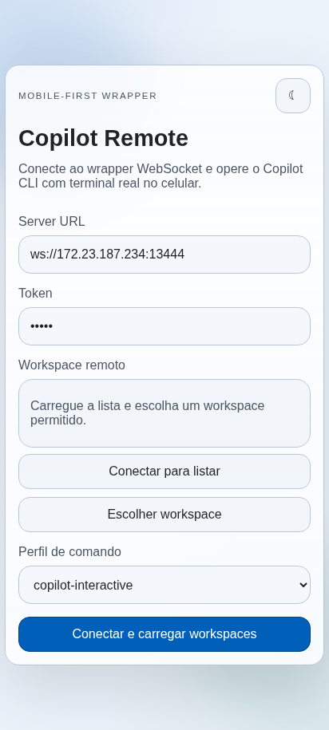
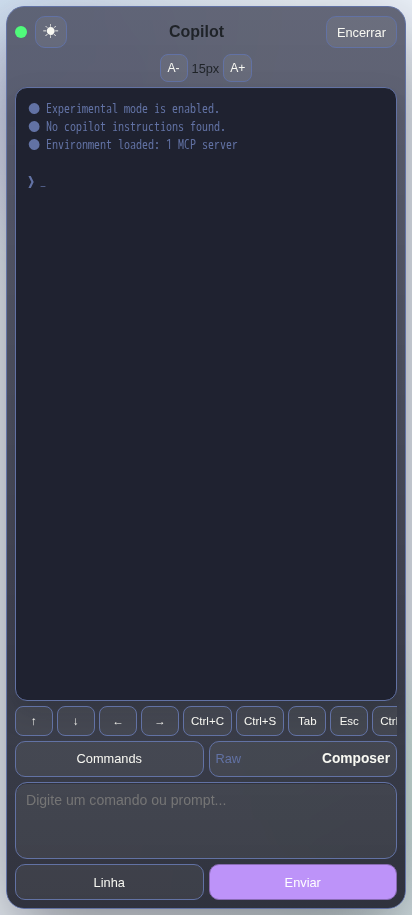
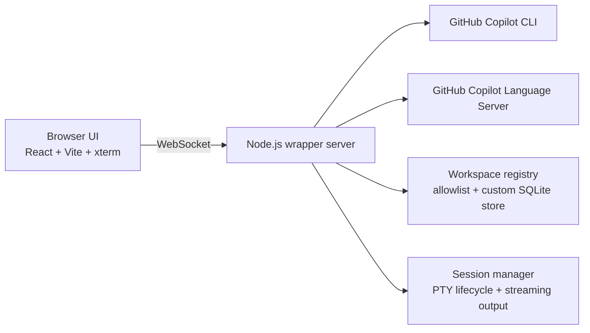

# copilot-api-wrapper

<p align="center">
  <a href="README.pt-BR.md">Português (Brasil)</a>
</p>

<p align="center">
  Turn GitHub Copilot CLI into a browser-ready remote terminal with a WebSocket bridge, a mobile-first UI, and workspace-aware session control.
</p>

<p align="center">
  
  
  
  
  
</p>

## Why this exists

GitHub Copilot CLI is powerful, but it is still tied to a shell-first workflow. This project wraps it in a WebSocket server and pairs it with a responsive React client so you can open a real Copilot terminal from a desktop browser, tablet, or phone.

The result is not a demo shell. It is a practical remote workflow with session lifecycle management, command profiles, workspace allowlisting, custom workspace persistence, and a UI built for touch devices.

## First impression

<p align="center">
  
  
</p>

## What you get

| Capability | What it means in practice |
| --- | --- |
| Remote Copilot terminal | Expose Copilot CLI through a WebSocket server and interact with it live from the browser |
| Mobile-first frontend | Designed for phone and tablet use, including touch-friendly controls and terminal workflows |
| Real terminal rendering | ANSI output is preserved through xterm-based rendering instead of a fake text console |
| Workspace guardrails | Sessions are limited to approved absolute paths through `ALLOWED_CWDS` |
| Custom workspaces | Add extra directories from the UI and persist them in SQLite |
| Git repository discovery | Trigger an on-demand scan from the workspace picker to surface Git repos inside allowed roots |
| Command profiles | Start sessions with `copilot-interactive` or `gh-copilot-suggest` |
| Context-aware UX | Built-in workspace listing and context search support for faster prompting |
| Prompt autocomplete | Use GitHub Copilot LSP in the browser prompt editor and accept inline suggestions with `Tab` |

## Architecture at a glance



## Stack

- Backend: Node.js, TypeScript, `ws`, `node-pty`, `zod`, `pino`, `@github/copilot-language-server`
- Frontend: React 19, Vite 6, xterm.js
- Persistence: SQLite via `sql.js` for custom workspaces
- Tests: Vitest on both backend and frontend

## Prerequisites

- Node.js 20+
- `pnpm`
- GitHub Copilot CLI authenticated in the host environment
- At least one of these available in `PATH`:
  - `copilot`
  - `gh` with `gh copilot` support

If your environment needs an explicit token for the CLI or the Copilot language server, export one of these before starting the backend:

- `COPILOT_TOKEN`
- `GH_TOKEN`
- `GITHUB_COPILOT_TOKEN`
- `GH_COPILOT_TOKEN`

## Quick start

### 1. Install dependencies

```bash
pnpm install
pnpm --dir client install
```

### 2. Create your environment file

```bash
cp .env.example .env
```

Minimal example:

```env
PORT=3000
CLIENT_PORT=5173
CLIENT_HOST=0.0.0.0
WS_AUTH_TOKEN=dev-token
ALLOWED_CWDS=/home/your-user/projects
CUSTOM_CWDS_DB_PATH=artifacts/custom-cwds.sqlite
SESSION_TIMEOUT_MS=1800000
MAX_SESSIONS=10
```

### 3. Start the full development experience

```bash
pnpm dev:all
```

This helper script:

- loads `.env`
- checks for port conflicts
- starts backend and frontend together
- shuts both down on `Ctrl+C`

### Reset local exec state

```bash
pnpm cleanup
```

This removes the local `.env`, the `open-port` Copilot skill created by `exec.sh`, tracked `open-port` state files, and the legacy `/usr/local/bin/copilot-api` wrapper when it points to this project.

## Alternative run modes

Backend only:

```bash
pnpm dev
```

Frontend only:

```bash
pnpm client:dev
```

Production-style backend build:

```bash
pnpm build
pnpm start
```

Frontend production build:

```bash
pnpm client:build
```

Full production build:

```bash
pnpm build:all
```

## Environment reference

| Variable | Purpose |
| --- | --- |
| `PORT` | Port used by the WebSocket backend |
| `CLIENT_PORT` | Port used by the Vite frontend in development |
| `CLIENT_HOST` | Host interface used by Vite during development |
| `WS_AUTH_TOKEN` | Shared secret required for WebSocket connections |
| `ALLOWED_CWDS` | Comma-separated list of absolute paths allowed as session roots |
| `CUSTOM_CWDS_DB_PATH` | SQLite file used to persist custom workspaces |
| `SESSION_TIMEOUT_MS` | Session inactivity timeout in milliseconds |
| `MAX_SESSIONS` | Maximum number of simultaneous sessions |
| `COPILOT_LSP_PATH` | Optional custom executable or JS entrypoint for the GitHub Copilot language server used by prompt autocomplete |
| `VITE_BACKEND_HOST` | Optional frontend host override for the default WebSocket URL |
| `VITE_WS_URL` | Optional complete WebSocket URL override |

Important: the selected `cwd` must be inside one of the configured `ALLOWED_CWDS` paths, unless it was added as a custom workspace through the UI.

## How to use it

1. Open the frontend in your browser.
2. Enter the WebSocket server URL.
3. Enter the same `WS_AUTH_TOKEN` configured on the backend.
4. Load the workspace list and choose an allowed path, or add a custom absolute path.
5. Pick a command profile.
6. Start the session and interact with Copilot from the terminal view.
7. Use the prompt editor normally and accept inline autocomplete suggestions with `Tab` or the **Aceitar** button.

Example WebSocket URLs:

- Same machine: `ws://127.0.0.1:3000`
- Another device on the same network: `ws://YOUR-MACHINE-IP:3000`

## Command profiles

### `copilot-interactive`

- Tries the `copilot` executable first
- Falls back to `gh copilot` if needed
- Starts with `--yolo`, so the CLI does not pause for allowed confirmations

### `gh-copilot-suggest`

- Requires `gh` in `PATH`
- Uses the GitHub CLI Copilot flow directly

## Security notes

- The server accepts the auth token through `Authorization: Bearer <token>` and also supports a query-string token for browser-based WebSocket clients.
- Because browsers commonly send the token in the WebSocket URL, use `wss://` plus proper TLS outside trusted local networks.
- Restrict `ALLOWED_CWDS` aggressively. That variable is your main filesystem boundary for remote sessions.

## Validation and tests

Backend tests:

```bash
pnpm test
```

Frontend tests:

```bash
pnpm client:test
```

Quick manual validation:

- Confirm the backend is listening on `PORT`
- Open the Vite client in the browser
- Connect with a valid token and an allowed workspace
- Send a prompt and verify streaming terminal output
- Type in the prompt editor and verify Copilot autocomplete appears inline and can be accepted

## Extra docs

- English screenshots: [docs/SCREENSHOTS.en.md](docs/SCREENSHOTS.en.md)
- Portuguese screenshots: [docs/SCREENSHOTS.pt-BR.md](docs/SCREENSHOTS.pt-BR.md)
- Manual test notes: [docs/MANUAL_TEST.md](docs/MANUAL_TEST.md)

## Repository layout

```text
.
|-- src/                 # WebSocket server, sessions, security, workspace registry
|-- client/              # React/Vite mobile-first frontend
|-- docs/                # Screenshots and manual validation notes
|-- tests/               # Backend tests
|-- artifacts/           # Local runtime artifacts such as workspace storage
```

## The short pitch

If you want GitHub Copilot CLI to feel less like a machine-local shell tool and more like a portable, touch-friendly remote workspace, this wrapper is the missing layer.
