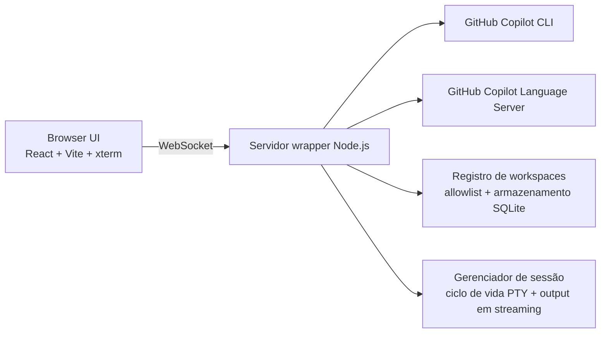

# copilot-api-wrapper

<p align="center">
  <a href="README.md">English</a>
</p>

<p align="center">
  Transforme o GitHub Copilot CLI em um terminal remoto acessível pelo navegador, com ponte WebSocket, interface mobile-first e controle de sessão por workspace.
</p>

<p align="center">
  
  
  
  
  
</p>

## Por que este projeto existe

O GitHub Copilot CLI é forte no terminal local, mas continua preso a um fluxo shell-first. Este projeto coloca uma camada WebSocket na frente do CLI e entrega uma interface React responsiva para você abrir um terminal real do Copilot no desktop, tablet ou celular.

Não é apenas um console improvisado. O fluxo inclui gerenciamento de sessão, perfis de comando, allowlist de workspaces, persistência de workspaces customizados e uma interface pensada para toque.

## Primeira impressão

<p align="center">
  
  
</p>

## O que você ganha

| Capacidade | O que isso significa na prática |
| --- | --- |
| Terminal remoto do Copilot | Exponha o Copilot CLI por WebSocket e interaja em tempo real pelo navegador |
| Frontend mobile-first | Interface desenhada para celular e tablet, com controles apropriados para toque |
| Renderização real de terminal | O output ANSI é preservado com xterm, em vez de uma caixa de texto simulada |
| Guardrails de workspace | Sessões ficam limitadas aos caminhos absolutos aprovados em `ALLOWED_CWDS` |
| Workspaces customizados | Adicione diretórios extras pela UI e persista tudo em SQLite |
| Descoberta de repositórios Git | Dispare uma varredura sob demanda no seletor para listar repos Git dentro das roots permitidas |
| Perfis de comando | Inicie sessões com `copilot-interactive` ou `gh-copilot-suggest` |
| UX orientada a contexto | Lista de workspaces e busca de contexto para acelerar prompts |
| Autocomplete no prompt | Use o GitHub Copilot LSP no editor de prompt do browser e aceite sugestões inline com `Tab` |

## Arquitetura em uma olhada



## Stack

- Backend: Node.js, TypeScript, `ws`, `node-pty`, `zod`, `pino`, `@github/copilot-language-server`
- Frontend: React 19, Vite 6, xterm.js
- Persistência: SQLite via `sql.js` para workspaces customizados
- Testes: Vitest no backend e no frontend

## Pré-requisitos

- Node.js 20+
- `pnpm`
- GitHub Copilot CLI autenticado no ambiente
- Pelo menos um destes executáveis no `PATH`:
  - `copilot`
  - `gh` com suporte a `gh copilot`

Se o seu ambiente precisar de token explícito para o CLI ou para o Copilot Language Server, exporte uma destas variáveis antes de subir o backend:

- `COPILOT_TOKEN`
- `GH_TOKEN`
- `GITHUB_COPILOT_TOKEN`
- `GH_COPILOT_TOKEN`

## Início rápido

### 1. Instale as dependências

```bash
pnpm install
pnpm --dir client install
```

### 2. Crie o arquivo de ambiente

```bash
cp .env.example .env
```

Exemplo mínimo:

```env
PORT=3000
CLIENT_PORT=5173
CLIENT_HOST=0.0.0.0
WS_AUTH_TOKEN=dev-token
ALLOWED_CWDS=/home/seu-usuario/projetos
CUSTOM_CWDS_DB_PATH=artifacts/custom-cwds.sqlite
SESSION_TIMEOUT_MS=1800000
MAX_SESSIONS=10
```

### 3. Suba a experiência completa de desenvolvimento

```bash
pnpm dev:all
```

Esse script auxiliar:

- carrega o `.env`
- valida conflito de portas
- sobe backend e frontend juntos
- encerra ambos com `Ctrl+C`

### Reset do estado local do exec

```bash
pnpm cleanup
```

Esse comando remove o `.env` local, a skill `open-port` criada pelo `exec.sh`, os arquivos de estado rastreados do `open-port` e o wrapper legado `/usr/local/bin/copilot-api` quando ele aponta para este projeto.

## Modos alternativos de execução

Somente backend:

```bash
pnpm dev
```

Somente frontend:

```bash
pnpm client:dev
```

Build do backend em estilo produção:

```bash
pnpm build
pnpm start
```

Build de produção do frontend:

```bash
pnpm client:build
```

Build completo de produção:

```bash
pnpm build:all
```

## Referência de variáveis de ambiente

| Variável | Finalidade |
| --- | --- |
| `PORT` | Porta do backend WebSocket |
| `CLIENT_PORT` | Porta do frontend Vite em desenvolvimento |
| `CLIENT_HOST` | Interface de rede usada pelo Vite em desenvolvimento |
| `WS_AUTH_TOKEN` | Segredo compartilhado exigido nas conexões WebSocket |
| `ALLOWED_CWDS` | Lista separada por vírgulas com caminhos absolutos permitidos como raiz de sessão |
| `CUSTOM_CWDS_DB_PATH` | Arquivo SQLite usado para persistir workspaces customizados |
| `SESSION_TIMEOUT_MS` | Timeout de inatividade da sessão em milissegundos |
| `MAX_SESSIONS` | Número máximo de sessões simultâneas |
| `COPILOT_LSP_PATH` | Executável ou entrypoint JS opcional do GitHub Copilot Language Server usado no autocomplete do prompt |
| `VITE_BACKEND_HOST` | Override opcional de host no frontend para compor a URL padrão do WebSocket |
| `VITE_WS_URL` | Override opcional da URL completa do WebSocket |

Importante: o `cwd` selecionado precisa estar dentro de um dos caminhos configurados em `ALLOWED_CWDS`, a menos que tenha sido adicionado como workspace customizado pela interface.

## Como usar

1. Abra o frontend no navegador.
2. Informe a URL do servidor WebSocket.
3. Informe o mesmo `WS_AUTH_TOKEN` configurado no backend.
4. Carregue a lista de workspaces e escolha um caminho permitido, ou adicione um caminho absoluto customizado.
5. Escolha um perfil de comando.
6. Inicie a sessão e interaja com o Copilot pela tela do terminal.
7. Digite no editor de prompt e aceite as sugestões inline com `Tab` ou pelo botão **Aceitar**.

Exemplos de URL WebSocket:

- Mesma máquina: `ws://127.0.0.1:3000`
- Outro dispositivo na mesma rede: `ws://IP-DA-MAQUINA:3000`

## Perfis de comando

### `copilot-interactive`

- Tenta o executável `copilot` primeiro
- Faz fallback para `gh copilot` quando necessário
- Inicia com `--yolo`, então a CLI não pausa para confirmações permitidas

### `gh-copilot-suggest`

- Exige `gh` no `PATH`
- Usa diretamente o fluxo Copilot da GitHub CLI

## Notas de segurança

- O servidor aceita o token tanto via `Authorization: Bearer <token>` quanto por query string para clientes WebSocket no browser.
- Como navegadores frequentemente enviam o token na URL do WebSocket, use `wss://` com TLS real fora de redes locais confiáveis.
- Restrinja `ALLOWED_CWDS` com rigor. Essa variável é a principal fronteira de filesystem das sessões remotas.

## Validação e testes

Testes do backend:

```bash
pnpm test
```

Testes do frontend:

```bash
pnpm client:test
```

Validação manual rápida:

- Confirme que o backend está ouvindo em `PORT`
- Abra o client Vite no navegador
- Conecte com token válido e um workspace permitido
- Envie um prompt e valide o output em streaming no terminal
- Digite no editor de prompt e valide que o autocomplete do Copilot aparece e pode ser aceito

## Documentação extra

- Capturas em inglês: [docs/SCREENSHOTS.en.md](docs/SCREENSHOTS.en.md)
- Capturas em português: [docs/SCREENSHOTS.pt-BR.md](docs/SCREENSHOTS.pt-BR.md)
- Notas de teste manual: [docs/MANUAL_TEST.md](docs/MANUAL_TEST.md)

## Estrutura do repositório

```text
.
|-- src/                 # Servidor WebSocket, sessões, segurança e registro de workspaces
|-- client/              # Frontend React/Vite mobile-first
|-- docs/                # Capturas e notas de validação manual
|-- tests/               # Testes do backend
|-- artifacts/           # Artefatos locais de runtime, como armazenamento de workspaces
```

## O pitch curto

Se você quer que o GitHub Copilot CLI deixe de parecer uma ferramenta presa à máquina local e passe a funcionar como um workspace remoto, portátil e amigável para toque, este wrapper entrega exatamente essa camada.
