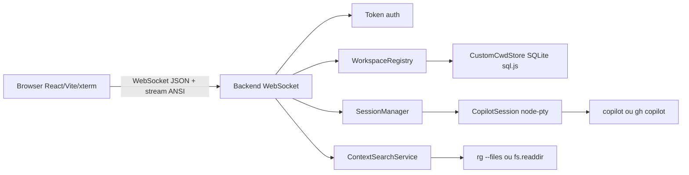
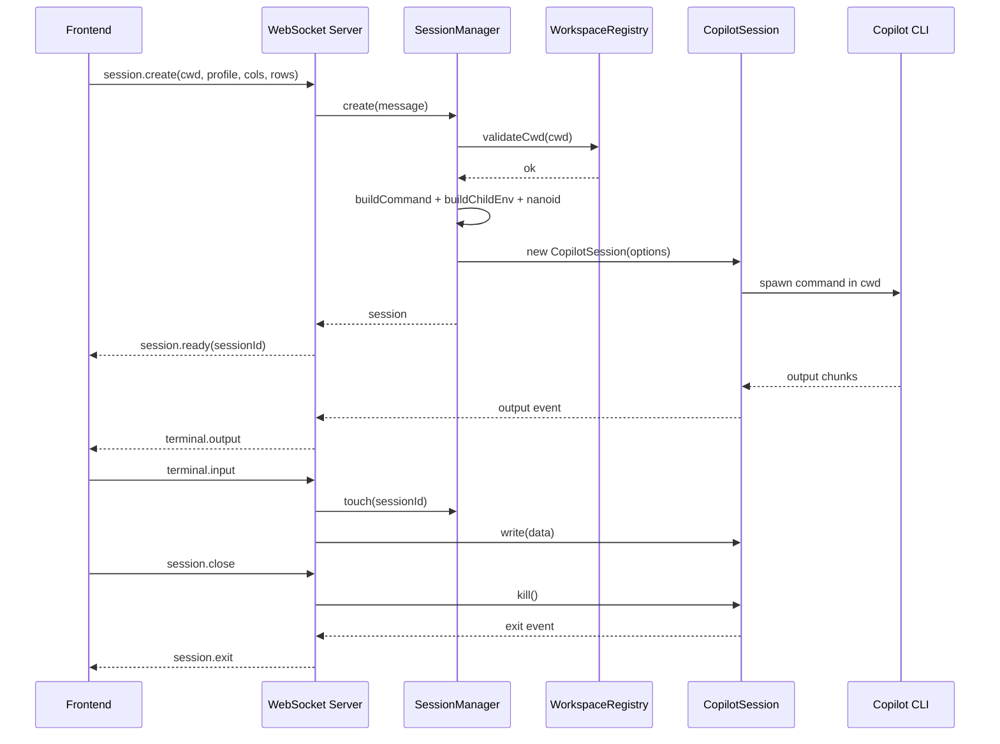

# TRD: Copilot API Wrapper

**Data**: 2026-05-21  
**Status**: Documento técnico derivado do estado atual do repositório  
**Produto**: `copilot-api-wrapper`  
**Escopo primário**: servidor WebSocket Node.js, sessões PTY, frontend React/Vite mobile-first e persistência local de workspaces

---

## 1. Visão técnica

O `copilot-api-wrapper` é uma aplicação TypeScript composta por um backend WebSocket e um frontend SPA. O backend recebe conexões autenticadas, valida o diretório de trabalho solicitado, cria um processo PTY com o Copilot CLI e transmite input/output em tempo real. O frontend cria a experiência de terminal remoto no navegador, com xterm.js para renderização ANSI, hooks de estado para conexão/sessão e componentes mobile-first para input, comandos e menções.

O design técnico é orientado por três princípios:

1. Preservar comportamento real de terminal usando PTY no servidor e xterm.js no cliente.
2. Manter a fronteira de filesystem explícita por `ALLOWED_CWDS` e workspaces customizados validados.
3. Evitar acoplamento desnecessário entre stream de terminal e estado declarativo React.

---

## 2. Arquitetura atual



### 2.1 Pacotes do repositório

| Caminho                          | Papel                                                                             |
| -------------------------------- | --------------------------------------------------------------------------------- |
| `src/`                           | Backend principal: config, transporte, protocolo, segurança, sessões e workspaces |
| `client/`                        | Frontend React/Vite: UI, hooks, terminal, protocolo espelhado e testes            |
| `docs/`                          | Documentação operacional, screenshots, revisão mobile e estes documentos PRD/TRD  |
| `tests/`                         | Testes unitários e de integração do backend                                       |
| `packages/open-port-to-lan-mcp/` | Pacote auxiliar Windows MCP para abrir portas na LAN por TTL                      |

---

## 3. Stack técnica

### 3.1 Backend

| Tecnologia  | Uso                                                     |
| ----------- | ------------------------------------------------------- |
| Node.js 20+ | Runtime do servidor                                     |
| TypeScript  | Tipagem e build                                         |
| `ws`        | Servidor WebSocket                                      |
| `node-pty`  | Processo pseudo-terminal                                |
| `zod`       | Validação de configuração e mensagens                   |
| `pino`      | Logs estruturados                                       |
| `sql.js`    | Persistência SQLite embutida de workspaces customizados |
| `nanoid`    | Geração de IDs de sessão                                |
| `dotenv`    | Carregamento de configuração local                      |

### 3.2 Frontend

| Tecnologia               | Uso                                        |
| ------------------------ | ------------------------------------------ |
| React 19                 | UI componentizada                          |
| Vite 6                   | Dev server e build                         |
| TypeScript               | Tipagem do cliente                         |
| `@xterm/xterm`           | Renderização de terminal                   |
| `@xterm/addon-fit`       | Ajuste automático de cols/rows             |
| `@xterm/addon-webgl`     | Renderização acelerada quando disponível   |
| `@xterm/addon-ligatures` | Suporte a ligaduras de fonte               |
| Vitest + Testing Library | Testes de hooks, componentes e utilitários |

---

## 4. Configuração de runtime

O backend valida configuração por schema Zod e encerra o processo se variáveis obrigatórias forem inválidas.

| Variável              | Obrigatória | Padrão                         | Descrição                                                     |
| --------------------- | ----------- | ------------------------------ | ------------------------------------------------------------- |
| `PORT`                | Não         | `3000`                         | Porta do WebSocket backend                                    |
| `WS_AUTH_TOKEN`       | Sim         | Nenhum                         | Segredo compartilhado exigido para conexão                    |
| `ALLOWED_CWDS`        | Sim         | Nenhum                         | Lista de caminhos absolutos permitidos, separada por vírgulas |
| `CUSTOM_CWDS_DB_PATH` | Não         | `artifacts/custom-cwds.sqlite` | SQLite dos workspaces customizados                            |
| `SESSION_TIMEOUT_MS`  | Não         | `1800000`                      | Timeout de inatividade da sessão                              |
| `MAX_SESSIONS`        | Não         | `10`                           | Número máximo de sessões simultâneas                          |
| `LOG_LEVEL`           | Não         | `info`                         | Nível de log do backend                                       |

O frontend também usa variáveis Vite opcionais:

| Variável            | Descrição                                                           |
| ------------------- | ------------------------------------------------------------------- |
| `VITE_BACKEND_HOST` | Host usado para compor a URL WebSocket padrão                       |
| `VITE_BACKEND_PORT` | Porta usada para compor a URL WebSocket padrão                      |
| `VITE_WS_URL`       | URL WebSocket completa, com precedência sobre composição automática |

---

## 5. Componentes backend

### 5.1 `server.ts`

Responsável por compor a aplicação:

- Carrega `dotenv/config`.
- Instancia `WorkspaceRegistry` com `ALLOWED_CWDS` e `CustomCwdStore`.
- Instancia `SessionManager` com `MAX_SESSIONS` e `SESSION_TIMEOUT_MS`.
- Cria o WebSocket server.
- Registra shutdown gracioso para `SIGTERM` e `SIGINT`.

### 5.2 `config.ts`

Valida ambiente com Zod. Falhas de configuração são tratadas como erro fatal antes do servidor iniciar.

Requisitos técnicos:

- `WS_AUTH_TOKEN` deve ter tamanho mínimo 1.
- `ALLOWED_CWDS` deve conter ao menos um caminho depois de trim/split.
- `PORT` aceita inteiro a partir de 0, permitindo porta efêmera em testes.
- `SESSION_TIMEOUT_MS` e `MAX_SESSIONS` devem ser positivos.

### 5.3 `transport/websocketServer.ts`

É o roteador de mensagens WebSocket e dono do ciclo de vida por conexão.

Responsabilidades:

- Criar `WebSocketServer` na porta configurada.
- Extrair token do handshake.
- Rejeitar conexão não autorizada com close code `4401`.
- Manter heartbeat ping/pong a cada 30 segundos.
- Parsear JSON de entrada.
- Validar mensagem via `parseClientMessage`.
- Roteiar mensagens por `type`.
- Registrar sessões pertencentes ao socket.
- Encerrar sessões do socket quando a conexão fecha.
- Descartar respostas obsoletas de busca de contexto por sequência por sessão.

### 5.4 `sessions/SessionManager.ts`

Gerencia sessões ativas em memória.

Responsabilidades:

- Impor `MAX_SESSIONS`.
- Validar `cwd` com `WorkspaceRegistry` antes de criar sessão.
- Construir comando via `CopilotCommandFactory`.
- Construir ambiente filho via `buildChildEnv`.
- Gerar ID com `nanoid`.
- Criar `CopilotSession`.
- Resetar timeout em input, resize e busca de contexto.
- Matar e remover sessão por timeout.
- Remover sessão ao evento `exit`.
- Encerrar todas as sessões no shutdown.

### 5.5 `sessions/CopilotSession.ts`

Abstrai o processo PTY.

Responsabilidades:

- Executar `pty.spawn(command, args, options)`.
- Definir terminal como `xterm-256color`.
- Emitir `output` para cada chunk do PTY.
- Emitir `exit` com `exitCode` e `signal`.
- Escrever input no processo.
- Redimensionar PTY.
- Matar o processo com `SIGTERM` por padrão.

### 5.6 `sessions/ContextSearchService.ts`

Busca arquivos, pastas e workspace para menções.

Fluxo:

1. Valida `cwd` novamente via `WorkspaceRegistry`.
2. Normaliza query para lowercase/trim.
3. Para `workspace`, retorna item direto com path `.`.
4. Para `file` e `folder`, lista arquivos do workspace.
5. Tenta `rg --files --hidden --glob !.git`.
6. Se `rg` não existir, usa fallback recursivo com `fs.readdir`.
7. Filtra por inclusão simples da query.
8. Ordena por score: basename exato, prefixo, posição do match e ordem alfabética.
9. Retorna caminhos relativos e limita a 1-50 resultados.

Limitações atuais:

- Busca por caminho/nome, não por conteúdo.
- Não ignora todos os padrões de `.gitignore` no fallback por filesystem.
- Em workspaces muito grandes, fallback por filesystem pode ser mais caro.

### 5.7 `workspaces/WorkspaceRegistry.ts`

Centraliza regras de workspace.

Responsabilidades:

- Normalizar caminhos com `path.resolve`.
- Remover barras finais, exceto raiz.
- Mesclar paths configurados e customizados.
- Retornar lista ordenada de workspaces com `name` e `path`.
- Validar que `cwd` é absoluto.
- Permitir `cwd` igual ou contido em um path permitido.
- Validar e persistir workspace customizado se existir e for diretório.

Observação de segurança: quando um path permitido é a raiz do filesystem, qualquer caminho absoluto passa na verificação. Essa configuração deve ser evitada fora de sandboxes controladas.

### 5.8 `workspaces/CustomCwdStore.ts`

Persistência local dos workspaces adicionados via UI.

Modelo SQLite:

```sql
CREATE TABLE IF NOT EXISTS custom_cwds (
  path TEXT PRIMARY KEY NOT NULL,
  created_at TEXT NOT NULL DEFAULT CURRENT_TIMESTAMP
)
```

Características:

- Usa `sql.js` e arquivo `.sqlite` exportado em disco.
- Cria diretório do banco automaticamente.
- `add` usa `INSERT OR IGNORE`.
- Persiste o banco somente quando há modificação.

### 5.9 `cli/CopilotCommandFactory.ts`

Resolve executáveis e argumentos por perfil.

Perfis:

| Perfil                | Args                                        | Resolução                               |
| --------------------- | ------------------------------------------- | --------------------------------------- |
| `copilot-interactive` | `--log-level error --no-auto-update --yolo` | Tenta `copilot`; se ausente, tenta `gh` |
| `gh-copilot-suggest`  | `suggest --log-level error`                 | Exige `gh`                              |

Proteções:

- Bloqueia flags proibidas: `--allow-all`, `--autopilot`, `--allow-all-tools`, `--allow-all-paths`.
- Garante que perfil interativo inclua `--yolo`.

Restrição técnica atual: a resolução usa `which`. Em Windows nativo, é necessário ambiente compatível ou ajuste futuro para resolução multiplataforma, por exemplo `where` ou biblioteca dedicada.

### 5.10 `cli/environment.ts`

Constrói ambiente allowlist para o processo filho, evitando repassar todo o ambiente do servidor.

Variáveis permitidas:

- `HOME`
- `PATH`
- `TERM`
- `LANG`
- `LC_ALL`
- `LC_CTYPE`
- `USER`
- `LOGNAME`
- `SHELL`
- `COPILOT_GITHUB_TOKEN`
- `GH_TOKEN`

Se `TERM` não existir, define `xterm-256color`.

### 5.11 `security/auth.ts`

Autenticação do WebSocket.

Funções:

- Extrai token de `Authorization: Bearer <token>`.
- Extrai token de `?token=`.
- Usa header como precedência sobre query string.
- Compara token com tamanho igual usando acumulador XOR para reduzir early-exit timing leaks.

---

## 6. Protocolo WebSocket

O protocolo usa mensagens JSON com campo discriminador `type`. O output de terminal em si trafega como string dentro de `terminal.output.data`.

### 6.1 Cliente para servidor

#### `workspace.list`

Solicita workspaces permitidos.

```json
{ "type": "workspace.list" }
```

#### `workspace.addCustom`

Adiciona workspace customizado.

```json
{ "type": "workspace.addCustom", "path": "/abs/path" }
```

#### `session.create`

Cria sessão.

```json
{
  "type": "session.create",
  "cwd": "/abs/path/project",
  "commandProfile": "copilot-interactive",
  "cols": 120,
  "rows": 40
}
```

#### `terminal.input`

Envia input ao PTY.

```json
{
  "type": "terminal.input",
  "sessionId": "session-id",
  "data": "hello\r"
}
```

#### `terminal.resize`

Redimensiona o PTY.

```json
{
  "type": "terminal.resize",
  "sessionId": "session-id",
  "cols": 100,
  "rows": 30
}
```

#### `session.close`

Encerra sessão.

```json
{
  "type": "session.close",
  "sessionId": "session-id"
}
```

#### `context.search`

Busca contexto no workspace da sessão.

```json
{
  "type": "context.search",
  "sessionId": "session-id",
  "mentionType": "file",
  "query": "server",
  "limit": 20
}
```

Validação:

- `mentionType`: `file`, `folder` ou `workspace`.
- `limit`: inteiro positivo até 50.

### 6.2 Servidor para cliente

#### `workspace.list.results`

```json
{
  "type": "workspace.list.results",
  "workspaces": [{ "name": "project", "path": "/abs/path/project" }]
}
```

#### `session.ready`

```json
{
  "type": "session.ready",
  "sessionId": "session-id"
}
```

#### `terminal.output`

```json
{
  "type": "terminal.output",
  "sessionId": "session-id",
  "data": "\u001b[32mREADY\u001b[0m"
}
```

#### `session.exit`

```json
{
  "type": "session.exit",
  "sessionId": "session-id",
  "exitCode": 0,
  "signal": "SIGTERM"
}
```

#### `session.error`

```json
{
  "type": "session.error",
  "sessionId": "session-id",
  "code": "SESSION_NOT_FOUND",
  "message": "Session session-id not found"
}
```

Principais códigos observados:

- `PARSE_ERROR`
- `VALIDATION_ERROR`
- `WORKSPACE_LIST_FAILED`
- `WORKSPACE_ADD_CUSTOM_FAILED`
- `SESSION_CREATE_FAILED`
- `SESSION_NOT_FOUND`
- `CONTEXT_SEARCH_FAILED`

#### `context.search.results`

```json
{
  "type": "context.search.results",
  "sessionId": "session-id",
  "mentionType": "file",
  "query": "server",
  "items": [
    {
      "id": "src/server.ts",
      "kind": "file",
      "label": "server.ts",
      "path": "src/server.ts",
      "description": "src/server.ts"
    }
  ]
}
```

---

## 7. Ciclo de vida de sessão



Estados relevantes no frontend:

| Estado         | Significado                                                                    |
| -------------- | ------------------------------------------------------------------------------ |
| `idle`         | Nenhuma sessão em curso                                                        |
| `creating`     | Sessão criada no backend, aguardando prontidão do CLI                          |
| `active`       | Prompt do Copilot detectado e input liberado                                   |
| `closed`       | Sessão saiu/foi encerrada                                                      |
| `error`        | Erro de sessão ou protocolo                                                    |
| `disconnected` | WebSocket caiu durante sessão; UI não ressuscita sessão antiga automaticamente |

---

## 8. Componentes frontend

### 8.1 `App.tsx`

Orquestra o fluxo da SPA.

Responsabilidades:

- Persistir URL, token, `cwd`, raw mode e fonte.
- Inicializar tema, socket, sessão, workspace catalog, terminal, menções e histórico de output.
- Conectar/listar workspaces antes de criar sessão.
- Alternar entre tela de conexão e tela de terminal.
- Enviar prompts conforme perfil ativo.
- Resetar terminal e histórico ao criar/encerrar sessão.

### 8.2 Hooks principais

| Hook                  | Responsabilidade                                                                         |
| --------------------- | ---------------------------------------------------------------------------------------- |
| `useWebSocket`        | Conexão, reconexão com backoff, fila de mensagens, parse JSON e listeners                |
| `useSession`          | Estado de sessão, criação, input, resize, close, busca de contexto e listeners de output |
| `useWorkspaceCatalog` | Listagem, adição customizada e erros de workspace                                        |
| `useTerminal`         | xterm.js, addons, tema, fonte, fit, escrita e leitura de buffer                          |
| `useMentionSearch`    | Parser de menção ativa, debounce, busca remota e substituição do token                   |
| `useOutputHistory`    | Estado derivado para cópia de output                                                     |
| `useTheme`            | Alternância Dracula/VS Code Light e persistência                                         |
| `useViewportResize`   | Refit do terminal em mudanças de viewport/teclado virtual                                |

### 8.3 Componentes principais

| Componente           | Função                                                     |
| -------------------- | ---------------------------------------------------------- |
| `ConnectionScreen`   | Formulário de URL/token/workspace/perfil                   |
| `WorkspacePicker`    | Seleção e cadastro de workspaces                           |
| `TerminalScreen`     | Layout da sessão ativa                                     |
| `TerminalView`       | Contêiner imperativo do xterm                              |
| `Header`             | Estado de conexão, tema e encerramento                     |
| `QuickActions`       | Botões de teclas especiais                                 |
| `InputBar`           | Composer, envio, comandos e raw mode                       |
| `CommandPicker`      | Bottom sheet de comandos homologados                       |
| `MentionSearchSheet` | Bottom sheet de resultados `@file`/`@folder`/`@workspace`  |
| `CopyOutputSheet`    | Cópia de linhas do output                                  |
| `StatusBanner`       | Feedback de criação, erro, reconexão e sessão desconectada |

---

## 9. Estratégia de input no frontend

### 9.1 Modo normal

O usuário compõe o prompt em um input nativo. Ao enviar:

1. A UI envia o texto ao terminal.
2. Aguarda `PROMPT_SUBMIT_DELAY_MS` de 80ms.
3. Envia sequência de submissão conforme perfil.

Sequências:

| Perfil                | Sequência           |
| --------------------- | ------------------- |
| `copilot-interactive` | `Ctrl+S` (`\u0013`) |
| `gh-copilot-suggest`  | Enter (`\r`)        |

### 9.2 Modo raw

O input digitado é encaminhado diretamente ao PTY quando há sessão ativa. Esse modo é usado para interações mais próximas de um terminal tradicional.

### 9.3 Quick actions

| Botão    | Sequência  |
| -------- | ---------- |
| `↑`      | `\u001b[A` |
| `↓`      | `\u001b[B` |
| `←`      | `\u001b[D` |
| `→`      | `\u001b[C` |
| `Ctrl+C` | `\u0003`   |
| `Ctrl+S` | `\u0013`   |
| `Tab`    | `\t`       |
| `Esc`    | `\u001b`   |
| `Ctrl+D` | `\u0004`   |
| `Ctrl+L` | `\u000c`   |

---

## 10. Segurança

### 10.1 Controles existentes

| Controle                 | Implementação                                                  |
| ------------------------ | -------------------------------------------------------------- |
| Token obrigatório        | `WS_AUTH_TOKEN` verificado no handshake                        |
| Compatibilidade browser  | Suporte a `?token=`                                            |
| Rejeição explícita       | Close code `4401` para não autorizado                          |
| Allowlist de cwd         | `WorkspaceRegistry.validateCwd` antes de spawn e busca         |
| Paths absolutos          | `cwd` de sessão e workspace customizado precisam ser absolutos |
| Verificação de diretório | Workspace customizado precisa existir e ser diretório          |
| Ambiente filho restrito  | `buildChildEnv` não repassa todo `process.env`                 |
| Cleanup de sessão        | Fechamento de socket, timeout e shutdown matam PTYs            |
| Limite de sessão         | `MAX_SESSIONS` reduz consumo não controlado                    |
| Limite de busca          | `context.search.limit` máximo 50                               |

### 10.2 Riscos residuais

| Risco                      | Detalhe                                                       | Recomendação                                                        |
| -------------------------- | ------------------------------------------------------------- | ------------------------------------------------------------------- |
| Token em URL               | `?token=` pode aparecer em histórico/logs                     | Usar somente em LAN confiável ou com `wss://`; rotacionar token     |
| Falta de TLS nativo        | O backend WebSocket não termina TLS                           | Usar reverse proxy ou túnel seguro externo                          |
| `--yolo` no perfil padrão  | CLI pode executar ações com menos prompts de confirmação      | Restringir workspaces e usar ambientes descartáveis quando possível |
| Sem identidade por usuário | Token compartilhado não diferencia operadores                 | Adicionar autenticação por usuário se houver multiusuário           |
| Sem auditoria completa     | Logs não registram histórico de comandos de forma estruturada | Adicionar audit log opt-in se necessário                            |
| Root allowlist perigosa    | Permitir raiz libera qualquer caminho absoluto                | Evitar raiz em `ALLOWED_CWDS`                                       |

---

## 11. Observabilidade e operação

### 11.1 Logs atuais

O backend usa `pino` e registra eventos como:

- Server iniciado.
- Cliente conectado/desconectado.
- Conexão não autorizada.
- Erro de parse/validação/protocolo.
- Sessão registrada.
- PTY iniciado.
- PTY encerrado.
- Timeout de sessão.
- Falha em workspace, busca e WebSocket.

### 11.2 Lacunas operacionais

- Não há health endpoint HTTP.
- Não há métrica nativa Prometheus/OpenTelemetry.
- Não há painel de sessões ativas.
- Não há rotação automática de token.
- Não há logs de auditoria de comandos com retenção configurável.

---

## 12. Testes e qualidade

### 12.1 Cobertura automatizada observada

Backend:

- `ContextSearchService.test.ts`
- `validators.test.ts`
- `CopilotCommandFactory.test.ts`
- `WorkspaceRegistry.test.ts`
- `websocket-session.test.ts`
- `pty-bridge.test.ts`

Frontend:

- `terminalOutput.test.ts`
- `terminalInput.test.ts`
- `mentions.test.ts`
- `InputBar.test.tsx`
- `CopyOutputSheet.test.tsx`
- `useSession.test.tsx`
- `useOutputHistory.test.tsx`
- `useMentionSearch.test.tsx`
- `useWorkspaceCatalog.test.tsx`
- `WorkspacePicker.test.tsx`

Pacote auxiliar MCP:

- `validation.test.ts`
- `state.test.ts`
- `firewall.test.ts`

### 12.2 Comandos de validação

```bash
pnpm test
pnpm client:test
pnpm --dir packages/open-port-to-lan-mcp test
```

### 12.3 Teste manual recomendado

O teste manual deve cobrir:

- Conexão com header e com query token.
- Rejeição sem token.
- Criação de sessão em workspace permitido.
- Rejeição de `cwd` inválido.
- Streaming ANSI.
- Input normal e raw.
- Quick actions.
- Resize com teclado virtual.
- Menções `@file`, `@folder`, `@workspace`.
- Alternância de tema.
- Cópia de output.
- Encerramento por UI, fechamento de socket e timeout.

---

## 13. Build e execução

### 13.1 Instalação

```bash
pnpm install
pnpm --dir client install
```

### 13.2 Desenvolvimento

```bash
pnpm dev
pnpm client:dev
```

Ou fluxo combinado:

```bash
pnpm dev:all
```

Observação: `dev:all` usa `start.sh`, portanto assume ambiente com Bash e utilitários POSIX como `setsid`.

### 13.3 Build

```bash
pnpm build
pnpm client:build
```

### 13.4 Produção atual

```bash
pnpm build
pnpm start
```

O build do frontend gera assets estáticos independentes. O backend atual não é descrito como servidor de assets estáticos do frontend; servir o cliente em produção deve ser feito por Vite preview, servidor estático ou reverse proxy externo.

---

## 14. Compatibilidade e premissas

| Área                  | Premissa atual                                                            |
| --------------------- | ------------------------------------------------------------------------- |
| Runtime               | Node.js 20+                                                               |
| Gerenciador           | `pnpm`                                                                    |
| Shell dev combinado   | Bash/POSIX para `start.sh`                                                |
| CLI                   | `copilot` ou `gh` disponível no `PATH`                                    |
| Descoberta de binário | `which`, com limitação para Windows nativo                                |
| Terminal              | `node-pty` com dependências nativas disponíveis                           |
| Browser               | WebSocket, `localStorage`, APIs modernas de viewport e suporte a xterm.js |
| Rede                  | Localhost ou LAN confiável por padrão; `wss://` recomendado fora disso    |

---

## 15. Pacote auxiliar `open-port-to-lan-mcp`

O pacote em `packages/open-port-to-lan-mcp/` é separado do backend principal. Ele implementa um servidor MCP HTTP para Windows que cria regras temporárias de Windows Firewall, permitindo que dispositivos na mesma LAN acessem portas locais.

Ferramentas expostas:

- `open-port-to-lan`: abre porta TCP/UDP por TTL.
- `close-port`: remove regra antes do vencimento.
- `list-open-ports`: lista regras ativas.

Fronteiras:

- Não faz proxy de `localhost`.
- Não cria túnel para internet.
- Exige execução como Administrador.
- Deve usar `MCP_AUTH_TOKEN` e, se necessário, `ALLOWED_IPS`.

Relação com o produto principal: ajuda a tornar o backend/frontend acessíveis de celular/tablet em uma LAN Windows, mas não é requisito lógico para criar sessão Copilot.

---

## 16. Decisões técnicas relevantes

| Decisão                                   | Motivação                                                       | Trade-off                                                    |
| ----------------------------------------- | --------------------------------------------------------------- | ------------------------------------------------------------ |
| WebSocket em vez de HTTP polling          | Terminal exige baixa latência e bidirecionalidade               | Requer tratamento de reconexão e autenticação no handshake   |
| PTY real com `node-pty`                   | Preserva comportamento de terminal                              | Dependência nativa e cuidados de cleanup                     |
| xterm.js no frontend                      | Renderiza ANSI corretamente                                     | API imperativa precisa ficar fora do fluxo declarativo React |
| Token por query string                    | Browser WebSocket não permite headers customizados              | Token pode aparecer em URL/logs                              |
| SQLite via `sql.js`                       | Persistência simples sem serviço externo                        | Escrita por export do banco, adequada para baixo volume      |
| Tipos de protocolo duplicados no frontend | Simplicidade no MVP                                             | Risco de drift entre backend e client                        |
| Busca com `rg` e fallback FS              | Performance quando `rg` existe, portabilidade quando não existe | Fallback pode ser mais lento e menos fiel a ignores          |
| Uma sessão ativa na UI                    | Simplicidade UX mobile                                          | Não explora toda capacidade de `MAX_SESSIONS` por usuário    |

---

## 17. Requisitos técnicos futuros recomendados

### Alta prioridade

- Criar pacote compartilhado de protocolo para eliminar duplicação entre `src/protocol/messages.ts` e `client/src/lib/protocol.ts`.
- Substituir resolução de executável baseada apenas em `which` por abordagem multiplataforma.
- Documentar receita de produção com reverse proxy TLS e headers seguros.
- Adicionar health/status endpoint para operação.
- Corrigir/validar scripts de desenvolvimento para Windows nativo ou documentar WSL/Git Bash como requisito.

### Média prioridade

- Adicionar auditoria opt-in de sessões e comandos, com redaction de segredos.
- Adicionar métricas de sessão, erro e latência.
- Implementar política de permissão por workspace/perfil.
- Adicionar limpeza ou gerenciamento de workspaces customizados pela UI.
- Expandir busca de contexto para conteúdo com limites claros.

### Baixa prioridade

- Servir frontend estático pelo backend em modo produção.
- Criar PWA instalável.
- Suportar temas customizados.
- Implementar sessão múltipla no frontend.

---

## 18. Critérios técnicos de aceite

Um release técnico deve ser considerado pronto quando:

- `pnpm build` conclui sem erros.
- `pnpm test` conclui sem falhas.
- `pnpm client:build` conclui sem erros.
- `pnpm client:test` conclui sem falhas.
- Backend rejeita token ausente/incorreto.
- Backend aceita token correto por header e query string.
- `workspace.list` retorna paths normalizados.
- `workspace.addCustom` valida absoluto, existência e diretório.
- `session.create` cria PTY somente em workspace permitido.
- `terminal.input` e `terminal.resize` funcionam para sessão existente.
- Sessão inexistente retorna `SESSION_NOT_FOUND`.
- `context.search` respeita `cwd`, limite e caminhos relativos.
- Fechamento de socket limpa sessões do socket.
- Shutdown mata sessões e fecha store de workspaces.
- Teste manual mobile confirma terminal, input, menções, tema, resize e cópia de output.

---

## 19. Resumo técnico

Tecnicamente, o projeto é um console remoto especializado para o Copilot CLI, implementado com WebSocket, PTY real e cliente React mobile-first. A arquitetura é enxuta e adequada ao objetivo local-first: o backend conserva as responsabilidades sensíveis de processo, filesystem e autenticação; o frontend concentra ergonomia, renderização e estado visual. Os principais riscos técnicos estão em segurança de transporte, compatibilidade multiplataforma, drift de protocolo e operação fora de uma rede confiável.
